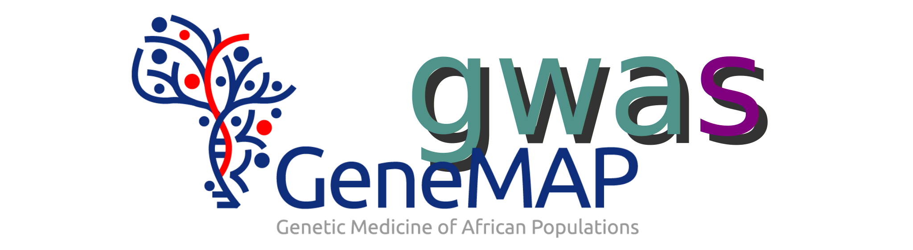

<p align="center"></p>

---

# Quick Start
- [Installation](#install)
  - [Requirements](#requirements)
  - [Install](#procedure)

---


# Installation <a name="install"></a>

## Requirements <a name="requirements"></a>
- [Nextflow](https://www.nextflow.io/docs/latest/getstarted.html#installation)
  
  Check that nextflow is installed on your cluster and load it.

{: .note-title }
> Preferred version:
>
> 21.10 or greater


- [Singularity](https://apptainer.org/docs/user/latest/quick_start.html#quick-installation)
  
  Singularity has now been changed to Apptainer, but most clusters to run it as singularity.
  We'll need singularity to pull the `gencall` docker container from our dockerhub account as
  a singularity image file.

  Check if singularity is installed on your cluster and load it.

{: .note-title }
> Preferred version:
>
> 3.5 or greater

---


## Install <a name="procedure"></a>
Navigate to the path where you would like to run the workflow from and run the code below.

```sh
wget https://github.com/GeneMAP-Research/genemapgwas/archive/refs/tags/v0.1.tar.gz
tar zxvf v0.1.tar.gz
rm v0.1.tar.gz
cd genemapgwas-0.1
```

---

_under development_